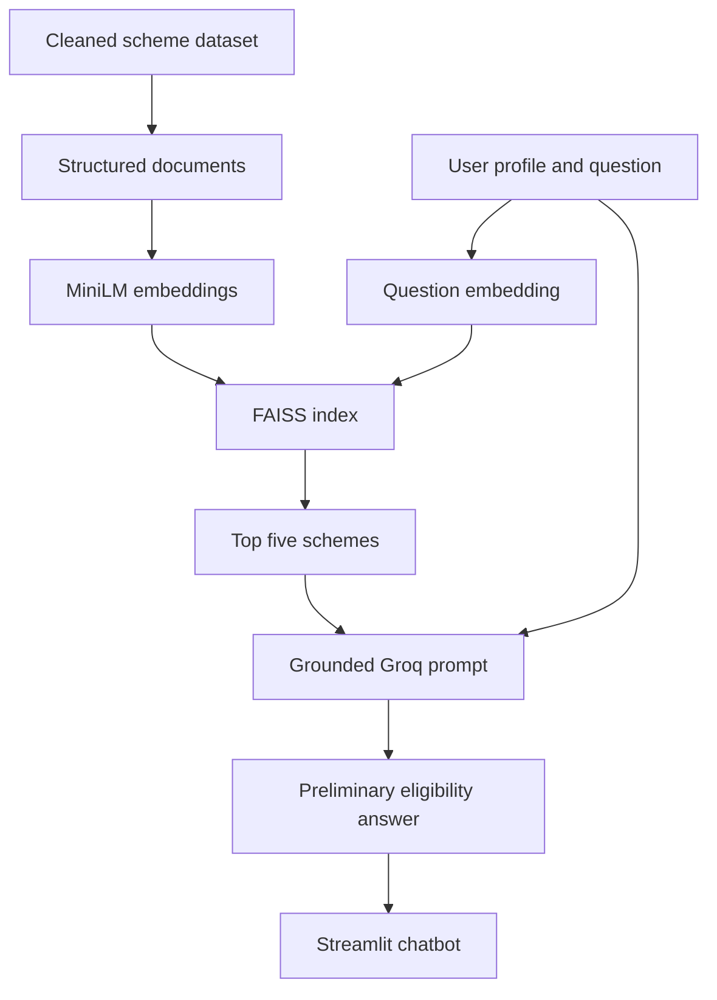

# YojanaSetu — Government Scheme Eligibility Assistant

YojanaSetu is a Retrieval-Augmented Generation (RAG) chatbot that helps users discover relevant Indian government schemes and understand their preliminary eligibility, benefits, required documents and application process.

The system searches a real dataset of 3,400 government schemes using semantic similarity and gives the retrieved information to the Groq LLM through a strict grounding prompt. This reduces unsupported answers and keeps the response connected to the available scheme data.

> **Important:** YojanaSetu provides preliminary guidance only. Users must verify current eligibility, deadlines and application information through the relevant official government portal.

## Project Information

| Item | Details |
|---|---|
| Team Number | 06 |
| Team Name | YojanaSetu |
| Domain | Artificial Intelligence / Machine Learning |
| Approach | Retrieval-Augmented Generation (RAG) |
| Dataset | 3,400 Indian government scheme records |
| Frontend | Streamlit |

### Team Members

- K. Bhavanasri
- K. Mounika
- Ch. Abhilash
- G. Jaswin

## Problem Statement

Information about Indian government schemes is distributed across different sources and can be difficult to search and understand. Citizens may not know:

- which schemes are relevant to their situation;
- whether they satisfy the listed eligibility requirements;
- what benefits are provided;
- which documents are required;
- how to apply; or
- whether a scheme is applicable to their state, category, education or occupation.

A normal generative-AI chatbot may also provide unsupported, outdated or invented information when it answers without a verified knowledge source.

## Proposed Solution

YojanaSetu allows users to provide details such as age, state, category, occupation, education and annual family income, and then ask a question in natural language.

The system:

1. converts the user profile and question into an embedding;
2. searches the FAISS index containing the scheme embeddings;
3. retrieves the five most relevant scheme documents;
4. sends only the retrieved information and user question to Groq;
5. generates a structured, dataset-grounded response; and
6. displays preliminary eligibility, matching conditions, missing information, benefits, documents and application steps.

## Main Features

- Semantic search across 3,400 government schemes
- User-profile-based preliminary eligibility guidance
- Structured scheme recommendations
- Benefits, documents and application-process explanation
- Strict dataset-grounded Groq prompt
- Suggested questions for students, farmers, women entrepreneurs and low-income families
- New Chat functionality
- Session-based chat history
- Open and delete individual conversations
- Clear-all-chat option with confirmation
- Professional dark Streamlit interface
- Secure API-key loading through environment variables

## Technology Stack

| Component | Technology | Purpose |
|---|---|---|
| Programming language | Python | Implements preprocessing, retrieval, generation and UI |
| Dataset processing | Pandas | Inspects, cleans and transforms CSV data |
| Numerical arrays | NumPy | Prepares embeddings in the format required by FAISS |
| Embedding library | Sentence Transformers | Loads the embedding model |
| Embedding model | `all-MiniLM-L6-v2` | Converts scheme text and user questions into 384-dimensional vectors |
| Vector search | FAISS CPU | Stores and searches scheme embeddings using L2 distance |
| Document storage | Python Pickle | Stores readable documents corresponding to FAISS vector positions |
| Generative model | Groq | Generates the grounded, human-readable response |
| Groq SDK | Groq Python SDK | Connects the Python backend to the Groq API |
| Secret configuration | Python Dotenv | Loads local environment variables from `.env` |
| Frontend | Streamlit | Provides the chatbot interface |
| State management | Streamlit Session State | Maintains profile and chat history during a session |
| Version control | Git and GitHub | Tracks, stores and shares the project |

## Dataset

The original Kaggle dataset is stored as:

```text
updated_data.csv
```

It initially contained 3,400 records and 11 columns:

```text
scheme_name
slug
details
benefits
eligibility
application
documents
level
schemeCategory
Unnamed: 9
tags
```

The `Unnamed: 9` column was empty, and some values were missing from `application`, `documents` and `tags`.

After cleaning, the result was saved as:

```text
schemes_cleaned.csv
```

Final result:

```text
3,400 rows
10 useful columns
0 missing values
```

## Data-Preparation Workflow

### 1. Dataset inspection — `check_data.py`

Loads `updated_data.csv` and checks:

- dataset shape;
- column names;
- sample records;
- missing values; and
- empty columns.

### 2. Data cleaning — `clean_data.py`

- removes `Unnamed: 9`;
- handles missing application information;
- handles missing document information;
- handles missing tags; and
- saves `schemes_cleaned.csv`.

### 3. Document preparation — `prepare_documents.py`

Converts each scheme row into one structured document containing:

```text
Scheme Name
Details
Benefits
Eligibility
Application Process
Documents Required
Level
Category
Tags
```

In the current implementation:

```text
One dataset row = One scheme document
```

### 4. Vector-index creation — `create_vector_db.py`

- loads `schemes_cleaned.csv`;
- creates one text document per scheme;
- uses `all-MiniLM-L6-v2` to generate embeddings;
- creates a `FAISS IndexFlatL2` index;
- adds all embeddings as `float32` vectors; and
- saves the FAISS index and corresponding documents.

Generated files:

```text
scheme_index.faiss
scheme_documents.pkl
```

`scheme_index.faiss` stores the numerical scheme vectors. `scheme_documents.pkl` stores the readable scheme documents in the same order.

### 5. Retrieval testing — `test_retrieval.py`

Converts a test question into an embedding, searches FAISS and displays the five most relevant scheme documents.

## RAG Architecture



## Runtime RAG Workflow

1. The user enters profile details and asks a question in `app.py`.
2. `app.py` combines the profile and question.
3. `app.py` calls `ask_schemesathi()` from `rag.py`.
4. `all-MiniLM-L6-v2` converts the complete question into a 384-dimensional vector.
5. FAISS compares the question vector with all 3,400 scheme vectors.
6. FAISS returns the positions and distances of the five nearest vectors.
7. The positions are used to retrieve complete scheme text from `scheme_documents.pkl`.
8. The question and retrieved schemes are placed in a strict grounding prompt.
9. Groq generates a structured preliminary eligibility response.
10. Streamlit displays the answer and stores it in session-based chat history.

The core relationship is:

```text
MiniLM converts → FAISS finds → Pickle provides → Groq explains → Streamlit displays
```

## Grounding and Hallucination Control

The Groq prompt instructs the model to:

- use only the retrieved scheme information;
- not invent schemes, eligibility conditions or benefits;
- not invent amounts, deadlines, documents, links or procedures;
- explicitly state when information is missing;
- avoid declaring official eligibility;
- identify matching, missing and conflicting user details; and
- recommend verification through the official government portal.

RAG reduces unsupported responses, but it does not guarantee zero hallucination. Scheme information can also change after the dataset is collected.

## Preliminary Eligibility Labels

YojanaSetu uses the following labels:

```text
Likely eligible based on the provided information
Likely not eligible based on the provided information
More information required
```

These labels are informational and do not replace verification by the responsible government authority.

## Project Structure

The application supports the vector files either in the project root or inside `vector_db/`. A recommended structure is:

```text
government_scheme_rag_chatbot/
├── .streamlit/
│   └── config.toml
├── vector_db/
│   ├── scheme_index.faiss
│   └── scheme_documents.pkl
├── app.py
├── rag.py
├── check_data.py
├── clean_data.py
├── prepare_documents.py
├── create_vector_db.py
├── test_retrieval.py
├── updated_data.csv
├── schemes_cleaned.csv
├── scheme_documents.txt
├── requirements.txt
├── .env.example
├── .gitignore
└── README.md
```

If files are reorganized, update the paths in the scripts or configure them using environment variables.

## Installation and Local Setup

### 1. Clone the repository

```bash
git clone https://github.com/Bhavanasri30/government_scheme_rag_chatbot.git
cd government_scheme_rag_chatbot
```

### 2. Create a virtual environment

Windows PowerShell:

```powershell
python -m venv .venv
.\.venv\Scripts\Activate.ps1
```

### 3. Install dependencies

```powershell
python -m pip install --upgrade pip
python -m pip install -r requirements.txt
```

Main dependencies:

```text
pandas
numpy
faiss-cpu
sentence-transformers
groq
python-dotenv
streamlit
```

### 4. Configure the Groq API key

Create a `.env` file in the project root:

```env
GROQ_API_KEY=your_groq_api_key
GROQ_MODEL=your_configured_groq_model
RAG_TOP_K=5
```

Do not commit `.env` to GitHub.

### 5. Ensure vector files exist

The application requires:

```text
scheme_index.faiss
scheme_documents.pkl
```

If they do not exist, generate them:

```powershell
python create_vector_db.py
```

### 6. Test retrieval

```powershell
python test_retrieval.py
```

### 7. Test the backend

```powershell
python rag.py
```

### 8. Run the Streamlit application

```powershell
python -m streamlit run app.py --server.fileWatcherType none
```

Open the local URL displayed in the terminal, normally:

```text
http://localhost:8501
```

## Example Questions

- I am a 20-year-old B.Tech student. Which scholarships may be available for me?
- Which government schemes are available for farmers?
- I am a woman planning to start a small business. Which schemes may help?
- Which education schemes are available for a low-income family?
- What schemes are available for SC students pursuing higher education?
- I am unemployed and live in Himachal Pradesh. Are there any allowance schemes?

Adding age, state, category, occupation, education and annual family income generally produces a better preliminary assessment.

## Environment Variables

| Variable | Required | Default | Purpose |
|---|---|---|---|
| `GROQ_API_KEY` | Yes | None | Authenticates Groq API requests |
| `GROQ_MODEL` | No | Project default | Selects the configured Groq model |
| `RAG_TOP_K` | No | `5` | Controls how many schemes are retrieved |
| `EMBEDDING_MODEL` | No | `all-MiniLM-L6-v2` | Selects the query embedding model |
| `FAISS_INDEX_PATH` | No | Auto-detected | Overrides the FAISS index path |
| `DOCUMENTS_PATH` | No | Auto-detected | Overrides the Pickle document path |

The embedding model used for queries must match the model used when building the FAISS index.

## Security

The following files and directories should remain in `.gitignore`:

```gitignore
.env
.env.*
!.env.example
.venv/
venv/
__pycache__/
*.pyc
.streamlit/secrets.toml
.vscode/
```

If an API key is accidentally committed or shown publicly, revoke it and generate a new key.

## Current Limitations

- Eligibility assessment is preliminary, not official.
- Scheme information may change after dataset collection.
- The quality of answers depends on the dataset fields and retrieval quality.
- FAISS semantic similarity does not guarantee that every retrieved scheme applies to the user.
- The current implementation retrieves complete scheme-level documents rather than smaller chunks.
- Chat history is stored only in Streamlit Session State and is lost when the session ends.
- User authentication and permanent profile storage are not currently implemented.

## Future Enhancements

- Permanent chat history using PostgreSQL
- User authentication and saved profiles
- Telugu, Hindi and other Indian-language support
- Voice input and text-to-speech output
- Direct verified links to official scheme portals
- Metadata filtering by state, category and occupation before vector search
- Rule-based eligibility validation in addition to LLM reasoning
- Re-ranking of retrieved schemes
- Retrieval confidence indicators
- Official API or regularly refreshed dataset integration
- Admin interface for updating scheme information
- User feedback and response-quality evaluation

## Repository

[Bhavanasri30/government_scheme_rag_chatbot](https://github.com/Bhavanasri30/government_scheme_rag_chatbot)

## Disclaimer

YojanaSetu is an educational hackathon prototype. It does not represent any government department and does not provide official eligibility decisions. Always verify scheme rules, deadlines and application procedures through the relevant official government website or authorized office.


